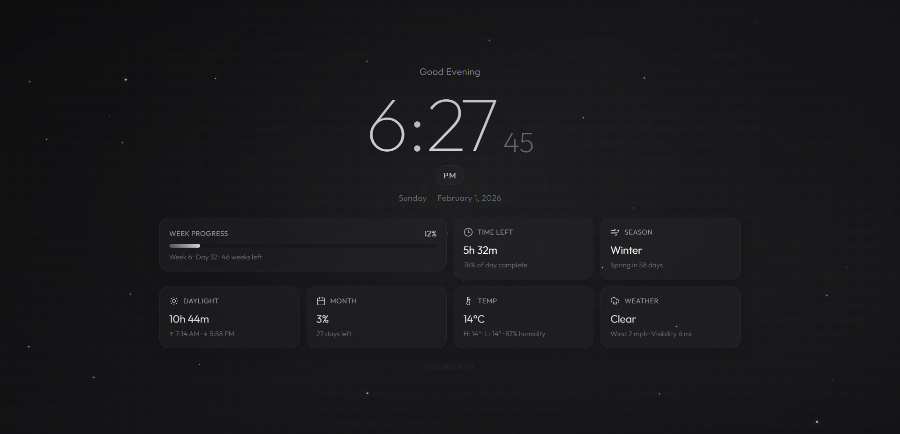

# ⏰ HourCast

**HourCast** is a sleek, minimal digital clock web app designed with a modern grey-and-black interface. Built using **React** and **Tailwind CSS**, it focuses on clarity, performance, and responsiveness across devices.

---

## 📋 Table of Contents

- [Project Overview](#project-overview)
- [Features](#features)
- [Project Structure](#project-structure)
- [Getting Started](#getting-started)
- [Available Scripts](#available-scripts)
- [Usage](#usage)
- [Preview](#preview)
- [License](#license)

---

## 🌐 Project Overview

**Hourcast** combines accurate time display with essential weather information in a distraction-free interface. The app is designed to be lightweight, readable, and responsive, making it suitable for both desktop and mobile use. Social media meta tags are included for improved sharing and visibility.

---

## ✨ Features

- **Minimal & Clean UI**: Grey-and-black design focused on readability.
- **Clock & Weather**: Displays time alongside weather information.
- **Responsive Design**: Optimized for mobile, tablet, and desktop using Tailwind CSS.
- **Cross-Browser Compatibility**: Works smoothly on modern browsers.
- **Social Media Ready**: Includes Open Graph and Twitter Card meta tags.

---

## 📂 Project Structure

```plaintext
├── .gitattributes
├── .gitignore
├── LICENSE
├── README.md
├── dist
│   └── output.css
├── package-lock.json
├── package.json
├── postcss.config.js
├── public
│   ├── favicon_io
│   │   ├── android-chrome-192x192.png
│   │   ├── android-chrome-512x512.png
│   │   ├── apple-touch-icon.png
│   │   ├── favicon-16x16.png
│   │   ├── favicon-32x32.png
│   │   ├── favicon.ico
│   │   └── site.webmanifest
│   └── index.html
├── src
│   ├── App.js
│   ├── components
│   │   └── DigitalClock.js
│   ├── index.css
│   └── index.js
└── tailwind.config.js
```

## 🚀 Getting Started

### Prerequisites

- **Node.js** (v14 or higher)
- **npm** (v6 or higher)

### Installation

1. **Clone the repository:**

```bash
git clone https://github.com/abhinavrathee/HourCast.git
```
2.	Navigate to the project directory:
```bash
cd HourCast
```

3.	Install dependencies:
```bash
npm install
```

4.	Start the development server:
```bash
npm start
```

5.	Build for production:
```bash
npm run build
```


## 📜 Available Scripts

-npm start: Runs the app in development mode.
-npm run build: Builds the app for production.

## 💻 Usage

After installation, access the app by visiting http://localhost:3000 in your browser. You can deploy Hourcast to platforms like Vercel, Netlify, or GitHub Pages for public access.

## 👀 Preview

A preview of the Hourcast interface:



---

## 📄 License

Licensed under the **MIT License**. See [LICENSE](./LICENSE).